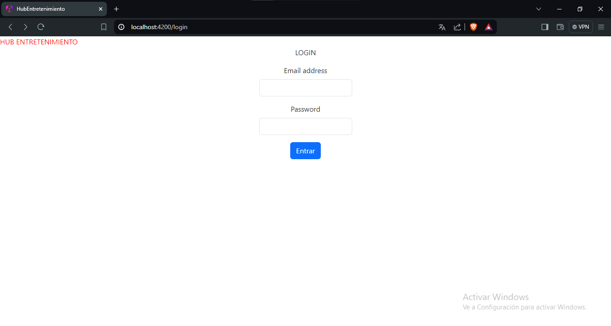
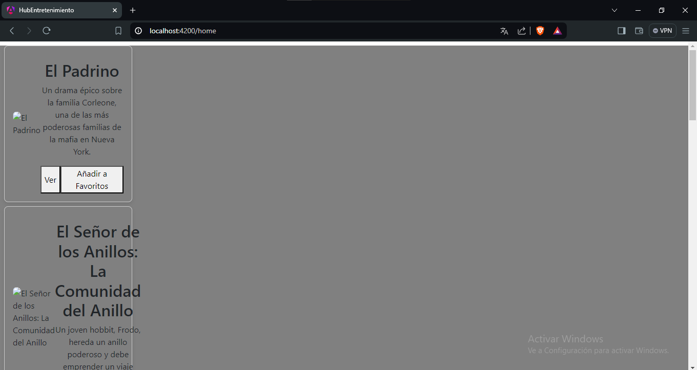

# HUB-Entretenimiento-MEGA - Luis Angel Marquez Vargaz
### Resumen del proyecto
Este proyecto es un Centro de Entretenimiento creado con propósitos de evaluación para Mega. Se trata de una aplicación de una sola página construida en Angular, donde se presentan imagenes de peliculas.

### ¿Cómo instalar?
1. Copiar el link del repositorio para clonarlo
2. Crear una carpeta y abrirla en VSC
3. Abrir la terminal y ejecutar el comando con el vinculo git clone
4. comando *cd entertainment-hub* 
5. instala Angular CLI desde la terminal con el comando npm install -g @angular/cli*
6. ejecutar comando npm install
7. Si no lo tienen es necesario instalar bootstrap 
7. Ejecuta el comando ng serve
8. En el resultado de la terminal indica el puerto [localhost](http://localhost:4200/) , puedes copiarlo y pegarlo en el navegador, puedes presionar ctrl y dar click en el enlace o puedes agregarlo manualmente en la barra de direcciones del navegador

### Proceso de desarrollo
Estuve viendo videos y siguiendo los cursos gratuitos que nos proporcionaron realmente eran muy completos, lo primero que me di cuenta es que debo trabajar realmente todos los aspectos, primero quize hacer el login viendo todas las opcion me decidi por utilizar bootstrap utilizando un form, mi idea en general era hacer la base del login con una imagen de fondo y un titulo, para poder acceder a la pagina principal, pensando en futuro ya despues implementar el login completo con la BD, despues en la pagina principal tener las peliculas y realizar toda la logica que lleva junto con sus acciones.
___
### Sprint Review
¿Qué salió bien? 
* El aprendizaje que obtube, el poder lograr un avance aunque sea pequeño me alegra haber podido conseguir algo. 
* Voy agarrando ritmo estoy seguro que con el tiempo podre implementar todas las funcionalidades y ponerme al dia con el sprint.
* Entendi la estructura de un proyecto en Angular.

¿Qué puedo hacer diferente?
Realmente todo; debo de pensar mejor la planeacion, el diseño, la codificacion, la logica, debo hacer una planeacion para ponerme al dia con los sprint atrasados, tengo realmente mucho que mejorar.

¿Qué no salió bien?
Mi principal problema ahorita fue ver como mostrar las imagenes, es algo que me a consumido algo de tiempo, por lo demas he tenido adversidades que he podido superar, pero como he mencionado todavia necesito mejorar mas, seguir aprendiendo y seguir implementando, jugar con el diseño y realmente hacer mucho trabajo.

### Capturas de pantalla

Esta es la vista del login (Se que falta mucho diseño pero trabajare en eso.)

Esta es la del home, me hace falta acomodar los carteles con su informacion y mostrar la imagen.
Se que parece poco pero realmente le he dedicado su tiempo, he aprendido mucho y estoy seguro que me podre poner al dia.
